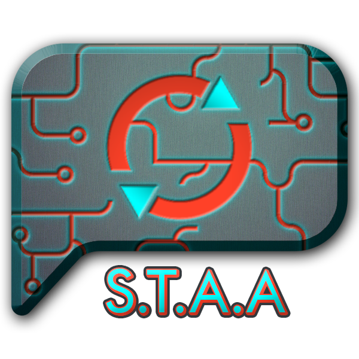

  

# Smart Text Auto-Advance Plugin

A quality-of-life plugin that automatically toggles FFXIV's "Text Auto-Advance" feature depending on whether or not the cutscene is voiced.

## Explanation

When a cutscene is started, the plugin will disable Auto-Advance. Then it "listens" for a voice line and, if detected, enables Auto-Advance again. By default, it also automatically enables Auto-Advance if you are in a party so that you don't accidentally waste their time (this is configurable if you don't like this behaviour).

## Commands

- `/staa` or `/smarttextautoadvance` to open the configuration window 
- `/staa toggle` or `/smarttextautoadvance toggle` to manually toggle Text Auto-Advance between enabled/disabled