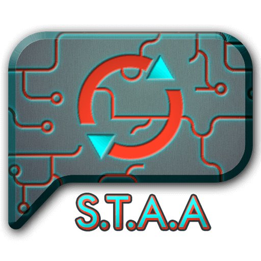

  

# Smart Text Auto-Advance Plugin

A quality-of-life plugin that automatically toggles FFXIV's "Text Auto-Advance" feature depending on whether or not the cutscene is voiced.

## Explanation

When a cutscene is started, the plugin will disable Auto-Advance. Then it "listens" for a voice line and, if detected, enables Auto-Advance again. By default, it also automatically enables Auto-Advance if you are in a party so that you don't accidentally waste their time (this is configurable if you don't like this behaviour).

## Commands

- `/staa` or `/smarttextautoadvance` to open the configuration window 
- `/staa toggle` or `/smarttextautoadvance toggle` to manually toggle Text Auto-Advance between enabled/disabled

## Special thanks

This plugin wouldn't have been possible without:
- [Wintermute](https://github.com/pmgr) for his singular neuron that holds the most profound of reverse-engineering knowledge
- [Anna Clemens](https://git.anna.lgbt/ascclemens) for her signatures and logic relating to `.scd` (sound) files and resource handling, taken from her [SoundFilter](https://git.anna.lgbt/ascclemens/SoundFilter) plugin
- [KazWolfe](https://github.com/KazWolfe) for his [superbly helpful guides](https://github.com/KazWolfe/dalamud-docs/tree/re-docs/docs/plugin-development) on the finer details of plugin development and advice
- [MidoriKami](https://github.com/MidoriKami) for coding and plugin advice
- [goatcorp](https://github.com/goatcorp) for Dalamud itself
- [The entire plugin-dev discord community](https://discord.gg/3NMcUV5) for helping me every step of the way

If I have forgotten anyone, let me know.